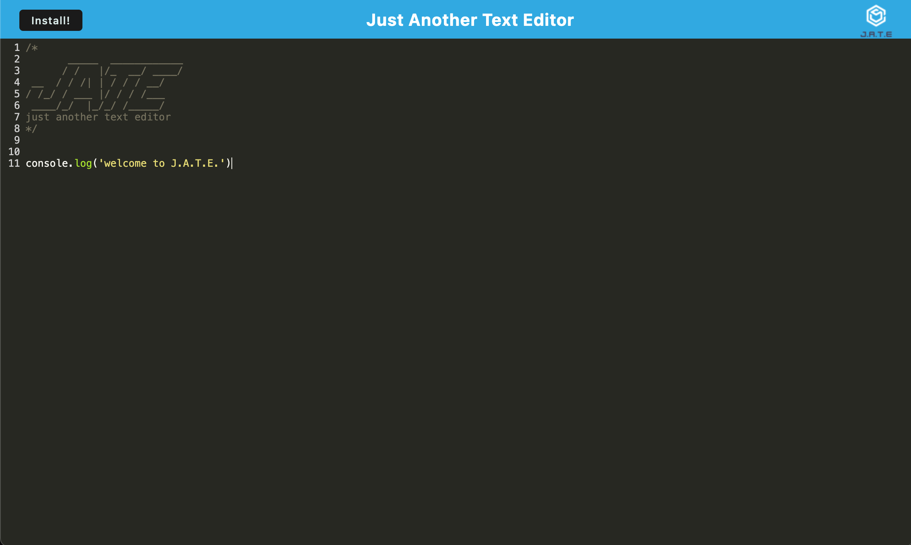

# Text Editor

  ## Description
 
J.A.T.E. (Just Another Text Editor) is a markdown text editor that runs in the browser. The app is a single-page application that meets the PWA criteria. Additionally, it features a number of data persistence techniques that serve as redundancy in case one of the options is not supported by the browser. The application will also function offline and can installed on the user's machine locally.
  
  ## Table of Contents
  
  - [Installation](#installation)
  - [Usage](#usage)
  - [Credits](#credits)
  - [License](#license)
  - [Questions](#questions)
  
  ## Installation
  To install this application locally, navigate to the [live site](https://jate-text-editor-y7h0.onrender.com). Once there, click the "Install" button located at the top left of the window.

  ## Usage
Take a moment to visit the live site: [Here](https://jate-text-editor-y7h0.onrender.com)

  ## Credits
* General Reference: https://www.w3schools.com/
* express.js: https://expressjs.com/
* PWA: https://developer.mozilla.org/en-US/docs/Web/Progressive_web_apps
* Readme Badge Generation: https://shields.io/

## License
This project is covered under the [MIT](https://opensource.org/licenses/MIT) license.

## Questions
Got questions? Use the info below to contact me! 
GitHub: [@ChrisVulpine](https://github.com/ChrisVulpine/) 
Email: [Chrisleach1191@gmail.com](mailto:Chris1191@gmail.com)

